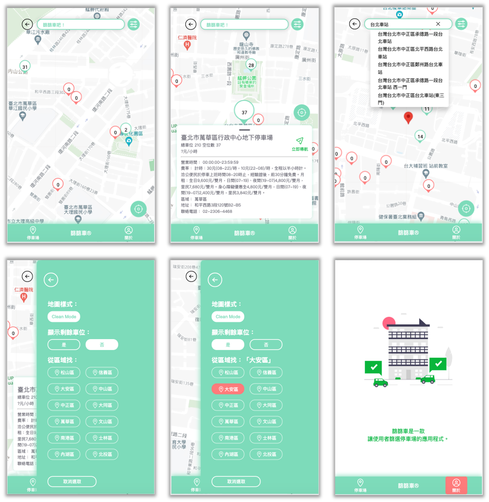
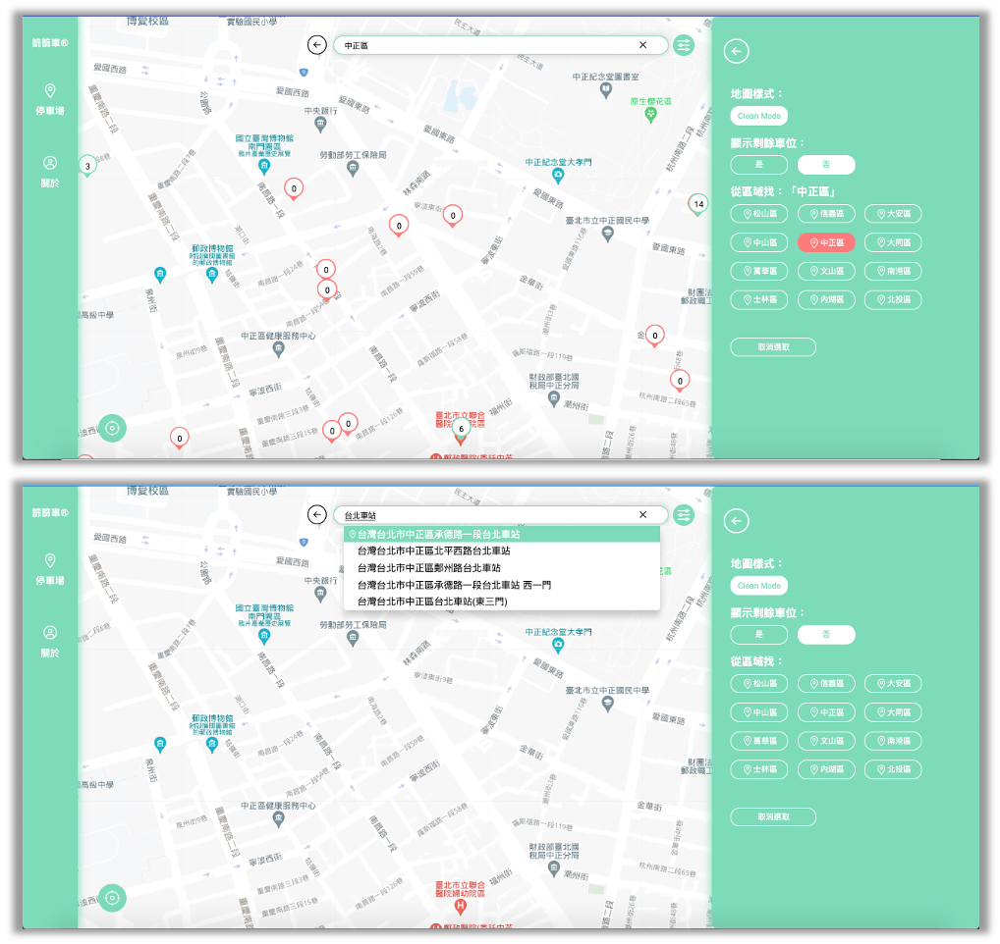

# 篩篩車
為您篩出台北市中最適合的停車位
****
## 產品資訊
##### 產品連結看這邊：https://yohalin.github.io/parking-lots/
#### ＊Mobile

#### ＊RWD

#### ＊功能：
##### 1.基本功能：
* 使用者進入網頁時，可以自動定位到該位置。
* 使用者也可以點擊定位按將畫面導至當前位置。
* 使用者可以查看600公尺內的停車場。
* 使用者可以自由放大或縮小地圖。
##### 2.詳細資訊：
* 使用者點擊停車場地標時，可以查看詳細資料。
* 使用者點擊導航按鈕可以連至Google Map應用程式，並導航。
##### 3.篩選功能：
* 使用者可以切換地圖模式。
* 使用者可以決定地圖上是否只顯示目前有剩餘停車位的停車場地標。
* 使用者可以點擊想查看的行政區停車場，並將畫面引導至該行政區。
##### 4.搜尋功能：
* 使用者可以輸入想查看的地方，並將畫面引導至該處。
* 使用者可以點擊刪除按鈕刪除已輸入的文字。
****
#### ＊開始使用：
##### Clone the project:
    git clone https://github.com/YohaLin/parking-lots.git
##### install:
    npm install
##### run the project:
    npm run start
****
#### ＊開發工具：
* react @18.2.0
* react-router-dom @18.2.0
* react-google-maps api @2.13.1
* redux toolkit @1.9.0
* proj4 @2.8.0
* sweetalert2 @11.6.7
* sass @1.55.0
* jest @27.5.1
* babel @7.20.2